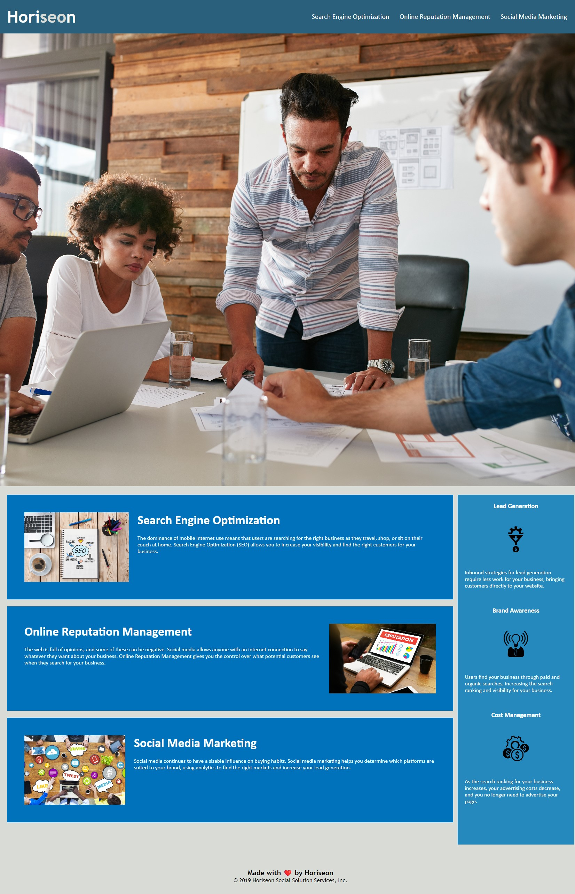

# horiseon-accessability-refactor PENN challenge 01

## Description

This is the initial assignment submitted by "AD" for Penn Full Stack Web Development. The innitial assignments goals were to correct the .css and .html, provided in a completed sample project, to load, operate, and be user friendly with semantic .html and corresponding style.css. This was achieved though applying class/id classification to specific elements within the code and adhering to the its styling laws. Additionally, condensing .css classifications and their attributes if they shared identical measurements and metrics proved to "clean up" the style.css file.

## Installation

N/A

## Usage

To navigate the landing page, the user can click on any topic in the top right corner and immediately be taken to the corresponding text concerning that topic. This allows for usability and a faster understanding of the companies offerings and benifits of search engine optimization.

## Credits

N/A

## License

MIT License
